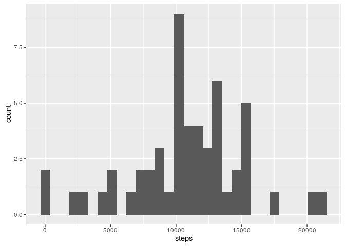
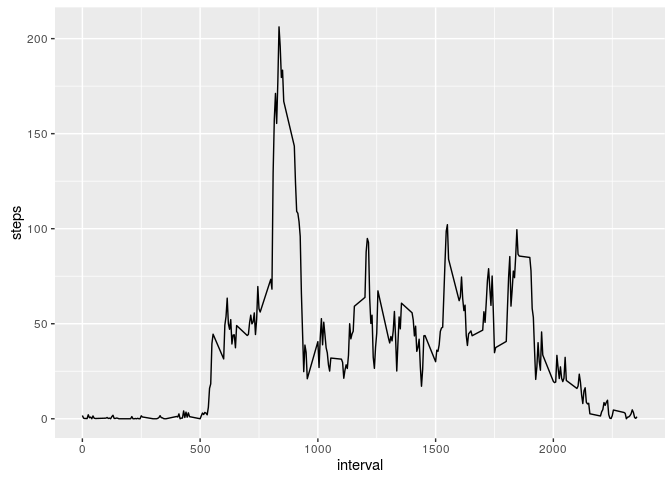
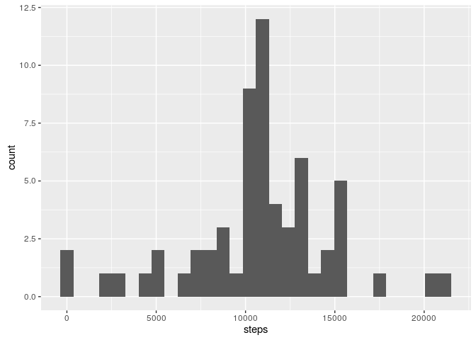
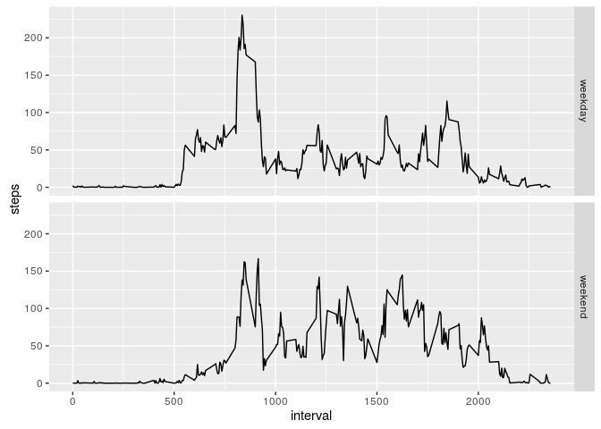

# Reproducible Research: Peer Assessment 1
Stephen Johnson  


## Loading and preprocessing the data

The data is provided as a zip file so first we unzip it into a subdirectory called "data" and then load the csv file into a dataframe. The data as provided has the number of steps per five-minute interval so we need to calculate the number of steps per day by summing the intervals for each day.


```r
library(utils)
unzip('activity.zip', exdir = "data")
activity <- read.csv('data/activity.csv')

library(dplyr)

# Calculate steps per day
daily <- activity %>% 
        select(date, steps) %>%
        group_by(date) %>%
        summarize_each(funs(sum))

# Calculate mean steps per time interval over all days
interval <- activity %>% 
        select(interval, steps) %>%
        group_by(interval) %>%
        summarize_each(funs(mean(., na.rm = TRUE)))
```


## What is mean total number of steps taken per day?

1. Make a histogram of the total number of steps taken each day


```r
library(ggplot2)
p <- ggplot(daily, aes(x=steps)) +
        geom_histogram()
p
```

<!-- -->


2. Calculate and report the **mean** and **median** total number of steps taken per day


```r
meansteps <- mean(daily$steps, na.rm = TRUE)
print(paste("Mean number of steps per day = ", meansteps))
```

```
## [1] "Mean number of steps per day =  10766.1886792453"
```

```r
mediansteps <- median(daily$steps, na.rm = TRUE)
print(paste("Median number of steps per day = ", mediansteps))
```

```
## [1] "Median number of steps per day =  10765"
```


## What is the average daily activity pattern?

1. Make a time series plot (i.e. type = "l") of the 5-minute interval (x-axis)
and the average number of steps taken, averaged across all days (y-axis)


```r
library(ggplot2)
p <- ggplot(interval, aes(x=interval, y=steps)) +
        geom_line()
p
```

<!-- -->

2. Which 5-minute interval, on average across all the days in the dataset,
contains the maximum number of steps?


```r
maxinterval <- interval %>% filter(steps == max(steps))
maxinterval$interval
```

```
## [1] 835
```


## Imputing missing values

1. Calculate and report the total number of missing values in the dataset
(i.e. the total number of rows with NAs)


```r
missing <- activity %>% filter(is.na(steps))
count(missing)
```

```
## # A tibble: 1 x 1
##       n
##   <int>
## 1  2304
```


2. Devise a strategy for filling in all of the missing values in the dataset.

I will use the mean for the 5 minute interval over all the days

3. Create a new dataset that is equal to the original dataset but with the
missing data filled in.


```r
# Make a vector of values with NA values replaced by mean values
imputed <- replace(activity$steps, is.na(activity$steps), interval$steps)
# Copy activity into a new dataframe
activity_imputed <- activity
# Replace steps with the omputed vector
activity_imputed$steps<- imputed

# Make a new dataframe of daily steps using the imputed data
daily_imputed <- activity_imputed %>% 
        select(date, steps) %>%
        group_by(date) %>%
        summarize_each(funs(sum))
```


4. Make a histogram of the total number of steps taken each day and Calculate
and report the mean and median total number of steps taken per day. 


```r
library(ggplot2)
p <- ggplot(daily_imputed, aes(x=steps)) +
        geom_histogram()
p
```

<!-- -->


```r
meansteps_imputed <- mean(daily_imputed$steps, na.rm = FALSE)
print(paste("Mean number of steps per day = ", meansteps_imputed))
```

```
## [1] "Mean number of steps per day =  10766.1886792453"
```

```r
mediansteps_imputed <- median(daily_imputed$steps, na.rm = FALSE)
print(paste("Median number of steps per day = ", mediansteps_imputed))
```

```
## [1] "Median number of steps per day =  10766.1886792453"
```

The mean is unchanged, however replacing NA values with the respective means has changed the median, which is now equal to the overall mean.

## Are there differences in activity patterns between weekdays and weekends?


```r
# Convert date from a factor to actual dates using lubridate
library(lubridate)
activity_imputed$date <- ymd(activity_imputed$date)
# Find day of week for each date
activity_imputed$day <- weekdays(activity_imputed$date)
# Make a new factor that depends on whether the day is a weekday or weekend
activity_imputed$daytype <- ifelse((activity_imputed$day %in% c("Saturday", "Sunday")), "weekend", "weekday")

# Recalculate mean steps per interval, grouped by weekday/weekend
interval_imputed <- activity_imputed %>% 
        select(interval, steps, daytype) %>%
        group_by(interval, daytype) %>%
        summarize_each(funs(mean(., na.rm = TRUE)))

# And plot a time series, faceted by weekday/weekend
p <- ggplot(interval_imputed, aes(x=interval, y=steps)) +
        geom_line() +
        facet_grid(daytype~.)
p
```

<!-- -->

There seems to be more activity during the day at weekends, and the person does not become active until later in the day - presumably they sleep in.

